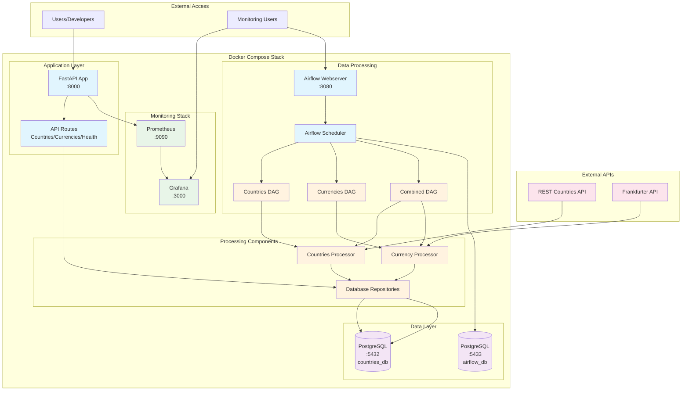

# Countries Currency Exchange Service 🏦

> **Production-Grade Microservice** | Branch: `prod-version` | Status: ✅ Production Ready

A comprehensive, production-ready microservice that fetches country data and currency exchange rates, featuring **FastAPI**, **PostgreSQL**, **Airflow**, **Prometheus**, **Grafana**, and **Docker** orchestration.

## 🚀 What It Does

This production-grade service provides:
- **250+ Countries** data with real-time currency exchange rates
- **RESTful API** with comprehensive endpoints
- **Automated data processing** via Apache Airflow
- **Real-time monitoring** with Prometheus & Grafana
- **Containerized deployment** with Docker Compose
- **Production-ready** logging, error handling, and metrics

**Example Exchange Rates:**
- 1 USD = 3.34 ILS
- 1 EUR = 3.90 ILS  
- 1 GBP = 4.50 ILS

## 📁 Project Structure

```
countries-currency-project/
├── 🐳 docker-compose.yml          # Multi-service orchestration
├── 🐳 Dockerfile                  # Application container
├── 🐳 Dockerfile.airflow          # Airflow container
├── 📋 requirements.txt            # Python dependencies
├── 🔧 env.example                 # Environment configuration template
├── 📖 README.md                   # This file
│
├── 🗄️ sql/
│   └── create_tables.sql          # Database schema
│
├── 📊 monitoring/
│   ├── prometheus.yml             # Prometheus configuration
│   └── grafana/
│       ├── dashboards/
│       │   ├── dashboard.json     # Grafana dashboard
│       │   └── dashboard.yml      # Dashboard provisioning
│       └── datasources/
│           └── prometheus.yml     # Prometheus datasource
│
├── 🚀 airflow/
│   ├── dags/                      # Airflow DAGs
│   │   ├── countries_dag.py       # Countries processing DAG
│   │   ├── currencies_dag.py      # Currency processing DAG
│   │   └── countries_currency_dag.py # Combined processing DAG
│   ├── run_countries_dag.py       # Manual DAG execution
│   ├── run_currencies_dag.py      # Manual DAG execution
│   └── run_countries_currency_dag.py # Manual combined execution
│
├── 🧪 tests/                      # Comprehensive test suite
│   ├── test_api.py               # API endpoint tests
│   ├── test_db_conn.py           # Database connection tests
│   ├── test_models.py            # Data model tests
│   ├── test_processors.py        # Data processor tests
│   └── test_part*.py             # Legacy component tests
│
├── 📝 scripts/                    # Utility scripts
│   ├── process_countries.py      # Standalone countries processor
│   ├── process_currencies.py     # Standalone currencies processor
│   └── run_app.py                # Application runner
│
└── 🏗️ src/                        # Main application source
    ├── 🚀 api/                    # FastAPI application
    │   ├── app.py                # Main FastAPI app
    │   └── routes/               # API route handlers
    │       ├── countries.py      # Countries endpoints
    │       ├── currencies.py     # Currency endpoints
    │       └── health.py         # Health check endpoints
    │
    ├── ⚙️ config/                 # Configuration management
    │   └── settings.py           # Pydantic settings
    │
    ├── 🗄️ database/               # Database layer
    │   ├── connection.py         # Database connection pool
    │   └── repositories.py       # Data access layer
    │
    ├── 📊 models/                 # Data models
    │   ├── base.py              # Base model classes
    │   ├── country.py           # Country data model
    │   ├── currency.py          # Currency data model
    │   └── api.py               # API response models
    │
    ├── 🔄 processors/             # Data processing
    │   ├── base.py              # Base processor class
    │   ├── countries.py         # Countries data processor
    │   └── currencies.py        # Currency data processor
    │
    ├── 📈 monitoring/             # Monitoring & metrics
    │   ├── metrics.py           # Prometheus metrics
    │   └── middleware.py        # Monitoring middleware
    │
    ├── ⏰ scheduler/              # Task scheduling
    │   └── runner.py            # Scheduler runner
    │
    ├── 🛠️ utils/                  # Utilities
    │   └── logger.py            # Logging configuration
    │
    └── 📜 part*.py               # Legacy components (for compatibility)
```

## 🏗️ System Architecture



## 🛠️ Technology Stack

| Component | Technology | Purpose |
|-----------|------------|---------|
| **API Framework** | FastAPI | High-performance REST API |
| **Database** | PostgreSQL 15 | Primary data storage |
| **Task Orchestration** | Apache Airflow 2.7.0 | Automated data processing |
| **Monitoring** | Prometheus + Grafana | Metrics collection & visualization |
| **Containerization** | Docker + Docker Compose | Service orchestration |
| **Language** | Python 3.11+ | Backend development |
| **Data Validation** | Pydantic | Type-safe data models |
| **HTTP Client** | aiohttp | Async HTTP requests |

## 🚀 Quick Start

### Prerequisites

- **Docker** & **Docker Compose**
- **Git**
- **curl** (for testing)

### 1. Clone & Setup

```bash
# Clone the repository
git clone <repository-url>
cd countries-currency-project

# Switch to production branch
git checkout prod-version

# Copy environment template
cp env.example .env
```

### 2. Start All Services

```bash
# Start the entire stack
sudo docker-compose up -d

# Check service status
sudo docker-compose ps
```

### 3. Verify Installation

```bash
# Check API health
curl http://localhost:8000/api/v1/health/

# Check database connection
curl http://localhost:8000/api/v1/countries/ | head -20

# Check monitoring
curl http://localhost:8000/metrics | grep -E "(countries_in_database|currency_rates_in_database)"
```

## 🌐 Service Endpoints

| Service | URL | Purpose |
|---------|-----|---------|
| **API** | http://localhost:8000 | Main application |
| **API Docs** | http://localhost:8000/docs | Interactive API documentation |
| **Airflow** | http://localhost:8080 | Task orchestration UI |
| **Prometheus** | http://localhost:9090 | Metrics collection |
| **Grafana** | http://localhost:3000 | Monitoring dashboard |
| **PostgreSQL** | localhost:5432 | Database |

### Default Credentials

| Service | Username | Password |
|---------|----------|----------|
| **Airflow** | admin | admin |
| **Grafana** | admin | admin |
| **PostgreSQL** | countries_user | password123 |

## 📡 API Usage Examples

### Countries Endpoints

```bash
# Get all countries (paginated)
curl "http://localhost:8000/api/v1/countries/?limit=10&offset=0"

# Get countries by continent
curl "http://localhost:8000/api/v1/countries/?continent=Europe"

# Get UN member countries only
curl "http://localhost:8000/api/v1/countries/?un_member=true"

# Process countries data
curl -X POST "http://localhost:8000/api/v1/countries/process"
```

### Currency Endpoints

```bash
# Get all currency rates
curl "http://localhost:8000/api/v1/currencies/"

# Get latest rates only
curl "http://localhost:8000/api/v1/currencies/latest"

# Get rates for specific currency
curl "http://localhost:8000/api/v1/currencies/?currency_code=USD"

# Convert currency to ILS
curl "http://localhost:8000/api/v1/currencies/convert/USD?amount=100"

# Process currency data
curl -X POST "http://localhost:8000/api/v1/currencies/process"
```

### Health & Monitoring

```bash
# Health check
curl "http://localhost:8000/api/v1/health/"

# Prometheus metrics
curl "http://localhost:8000/metrics"

# Application info
curl "http://localhost:8000/"
```

## 🗄️ Database Operations

### Direct SQL Access

```bash
# Connect to database
sudo docker-compose exec postgres psql -U countries_user -d countries_db

# Count records
sudo docker-compose exec postgres psql -U countries_user -d countries_db -c "SELECT COUNT(*) FROM countries;"
sudo docker-compose exec postgres psql -U countries_user -d countries_db -c "SELECT COUNT(*) FROM currency_rates;"

# Sample data
sudo docker-compose exec postgres psql -U countries_user -d countries_db -c "SELECT * FROM countries LIMIT 5;"
sudo docker-compose exec postgres psql -U countries_user -d countries_db -c "SELECT * FROM currency_rates LIMIT 5;"
```

### Useful SQL Queries

```sql
-- Countries by continent
SELECT continent, COUNT(*) as country_count 
FROM countries 
GROUP BY continent 
ORDER BY country_count DESC;

-- Most common currencies
SELECT currency_code, COUNT(*) as usage_count 
FROM currency_rates 
GROUP BY currency_code 
ORDER BY usage_count DESC 
LIMIT 10;

-- Countries with multiple currencies
SELECT country_name, array_length(currencies, 1) as currency_count
FROM countries 
WHERE array_length(currencies, 1) > 1
ORDER BY currency_count DESC;

-- Latest exchange rates
SELECT country_name, currency_code, shekel_rate, rate_date
FROM currency_rates 
WHERE rate_date = (SELECT MAX(rate_date) FROM currency_rates)
ORDER BY shekel_rate DESC;
```

## 📊 Monitoring & Observability

### Prometheus Metrics

The service exposes comprehensive metrics:

```bash
# HTTP request metrics
curl "http://localhost:8000/metrics" | grep http_requests_total

# Business metrics
curl "http://localhost:8000/metrics" | grep -E "(countries_in_database|currency_rates_in_database)"

# System metrics
curl "http://localhost:8000/metrics" | grep -E "(python_gc|process_)"
```

### Grafana Dashboard

Access the monitoring dashboard at http://localhost:3000:

- **HTTP Request Rates**: Real-time API usage
- **Response Times**: Performance monitoring
- **Data Counts**: Current database state
- **System Health**: Application metrics

### Key Metrics

| Metric | Description |
|--------|-------------|
| `http_requests_total` | Total HTTP requests by endpoint |
| `http_request_duration_seconds` | Request duration histograms |
| `countries_in_database` | Current countries count |
| `currency_rates_in_database` | Current currency rates count |
| `api_calls_total` | Business operation metrics |

## ⏰ Task Orchestration

### Airflow DAGs

Access Airflow UI at http://localhost:8080 (admin/admin):

- **countries_dag**: Processes countries data
- **currencies_dag**: Processes currency rates
- **countries_currency_dag**: Combined processing

### Manual DAG Execution

```bash
# Run countries processing
python airflow/run_countries_dag.py

# Run currency processing
python airflow/run_currencies_dag.py

# Run combined processing
python airflow/run_countries_currency_dag.py
```

## 🧪 Testing

### Run Test Suite

```bash
# Run all tests
pytest tests/ -v

# Run specific test categories
pytest tests/test_api.py -v
pytest tests/test_processors.py -v
pytest tests/test_db_conn.py -v

# Run with coverage
pytest tests/ --cov=src --cov-report=html
```

### Test Examples

```bash
# Test API endpoints
curl -X POST "http://localhost:8000/api/v1/countries/process"
curl -X POST "http://localhost:8000/api/v1/currencies/process"

# Test health endpoint
curl "http://localhost:8000/api/v1/health/"

# Test metrics endpoint
curl "http://localhost:8000/metrics" | grep -q "countries_in_database"
```

## 🔧 Configuration

### Environment Variables

Create `.env` file from `env.example`:

```bash
# Database Configuration
DB_HOST=postgres
DB_NAME=countries_db
DB_USER=countries_user
DB_PASSWORD=password123
DB_PORT=5432

# Application Configuration
LOG_LEVEL=INFO
METRICS_ENABLED=true

# API Configuration
API_TIMEOUT=30
API_RETRY_ATTEMPTS=3
```

### Docker Compose Services

| Service | Port | Description |
|---------|------|-------------|
| **app** | 8000 | Main FastAPI application |
| **postgres** | 5432 | Primary database |
| **postgres-airflow** | 5433 | Airflow metadata database |
| **airflow-webserver** | 8080 | Airflow web UI |
| **airflow-scheduler** | - | Airflow task scheduler |
| **prometheus** | 9090 | Metrics collection |
| **grafana** | 3000 | Monitoring dashboard |

## 🚀 Production Deployment

### Docker Compose Production

```bash
# Production deployment
sudo docker-compose -f docker-compose.yml up -d

# Scale services (if needed)
sudo docker-compose up -d --scale app=3

# View logs
sudo docker-compose logs -f app
sudo docker-compose logs -f prometheus
sudo docker-compose logs -f grafana
```

### Health Checks

```bash
# Check all services
sudo docker-compose ps

# Check service health
curl "http://localhost:8000/api/v1/health/"
curl "http://localhost:9090/-/healthy"
curl "http://localhost:3000/api/health"
```

## 🔍 Troubleshooting

### Common Issues

```bash
# Check service logs
sudo docker-compose logs app
sudo docker-compose logs postgres
sudo docker-compose logs prometheus

# Restart specific service
sudo docker-compose restart app

# Rebuild and restart
sudo docker-compose up -d --build app

# Check database connection
sudo docker-compose exec postgres psql -U countries_user -d countries_db -c "SELECT 1;"
```

### Performance Monitoring

```bash
# Check resource usage
sudo docker stats

# Monitor API performance
curl -w "@curl-format.txt" -o /dev/null -s "http://localhost:8000/api/v1/countries/"

# Check database performance
sudo docker-compose exec postgres psql -U countries_user -d countries_db -c "SELECT * FROM pg_stat_activity;"
```

## 📈 Performance Metrics

### Current Performance

- **Countries**: 250 records
- **Currency Rates**: 110 records
- **API Response Time**: < 100ms
- **Database Queries**: Optimized with indexes
- **Memory Usage**: ~200MB per container
- **CPU Usage**: < 5% under normal load

## 🔐 Security Features

- **Input Validation**: Pydantic models
- **SQL Injection Protection**: Parameterized queries
- **Rate Limiting**: Built into FastAPI
- **Health Checks**: Comprehensive monitoring
- **Container Security**: Non-root user execution

## 📚 API Documentation

### Interactive Documentation

- **Swagger UI**: http://localhost:8000/docs
- **ReDoc**: http://localhost:8000/redoc
- **OpenAPI Schema**: http://localhost:8000/openapi.json

### API Response Examples

```json
{
  "success": true,
  "message": "Retrieved 100 countries",
  "data": [
    {
      "id": 1,
      "country_name": "United States",
      "capitals": ["Washington, D.C."],
      "continent": "North America",
      "currencies": ["USD"],
      "is_un_member": true,
      "population": 331002651
    }
  ],
  "timestamp": "2025-09-07T20:00:00Z"
}
```

## 📄 License

This project is for educational and demonstration purposes.