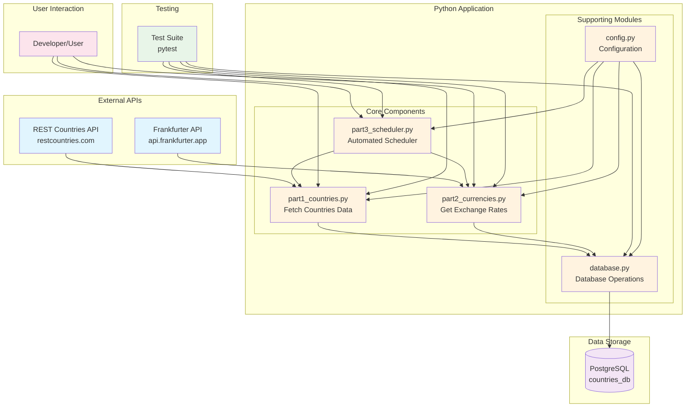

# Countries Currency Exchange Project

A simple Python project that **gets exchange rates from each currency to ILS (Israeli Shekel)**. This is a basic proof-of-concept version that demonstrates the core functionality.

## What It Does

This project fetches country data and their currencies, then gets the current exchange rates for each currency relative to the Israeli Shekel (ILS). For example:
- 1 USD = 3.34 ILS
- 1 EUR = 3.90 ILS  
- 1 GBP = 4.50 ILS

## 🏗️ System Architecture



## 📁 Project Structure

```
countries-currency-project/
├── src/                    # Main source code
│   ├── config.py          # Database and API configuration
│   ├── database.py        # PostgreSQL database operations
│   ├── part1_countries.py # Fetches countries data from REST Countries API
│   ├── part2_currencies.py # Gets currency exchange rates to ILS
│   └── part3_scheduler.py # Automated scheduler for updates
├── tests/                 # Test files
│   ├── test_db_conn.py    # Database connection tests
│   ├── test_part1_countries.py # Countries processing tests
│   ├── test_part2_currencies.py # Currency processing tests
│   └── test_part3_scheduler.py # Scheduler tests
├── sql/
│   └── create_tables.sql  # Database schema (countries & currency_rates tables)
├── requirements.txt       # Python dependencies
└── README.md              # This file
```

## Quick Start

### 1. Install Requirements

```bash
# Install PostgreSQL
sudo apt install postgresql postgresql-contrib -y

# Create virtual environment
python3 -m venv venv
source venv/bin/activate

# Install Python packages
pip install -r requirements.txt
```

### 2. Setup Database

```bash
# Create database and user
sudo -u postgres psql
CREATE DATABASE countries_db;
CREATE USER countries_user WITH PASSWORD 'password123';
GRANT ALL PRIVILEGES ON DATABASE countries_db TO countries_user;
\q

# Create tables
psql -U countries_user -d countries_db -h localhost -f sql/create_tables.sql
```

### 3. Configure Environment

Create `.env` file:
```
DB_HOST=localhost
DB_NAME=countries_db
DB_USER=countries_user
DB_PASSWORD=password123
DB_PORT=5432
```

### 4. Run the Project

```bash
# Option 1: Run everything at once
python src/part3_scheduler.py
# Choose option 1 for initial setup

# Option 2: Run parts separately
python src/part1_countries.py  # Load countries data
python src/part2_currencies.py # Get currency rates
```

## How It Works

1. **Part 1** (`part1_countries.py`): Fetches 250 countries from REST Countries API and stores them in PostgreSQL
2. **Part 2** (`part2_currencies.py`): Gets exchange rates for each country's currencies relative to ILS using Frankfurter API
3. **Part 3** (`part3_scheduler.py`): Automated scheduler that can run updates periodically

## APIs Used

- **REST Countries API**: https://restcountries.com/v3.1/all (for country data)
- **Frankfurter API**: https://api.frankfurter.app (for currency exchange rates)

## Testing

```bash
# Run all tests
pytest tests/ -v

# Run specific tests
pytest tests/test_part1_countries.py -v
pytest tests/test_part2_currencies.py -v
```

## Database Tables

- **countries**: Stores country information (name, capitals, currencies, etc.)
- **currency_rates**: Stores exchange rates (currency_code, shekel_rate, date)

## Note

This is a simple proof-of-concept version. A production-level implementation would include more advanced features, better error handling, monitoring, and additional technologies.

## License

This project is for educational purposes.