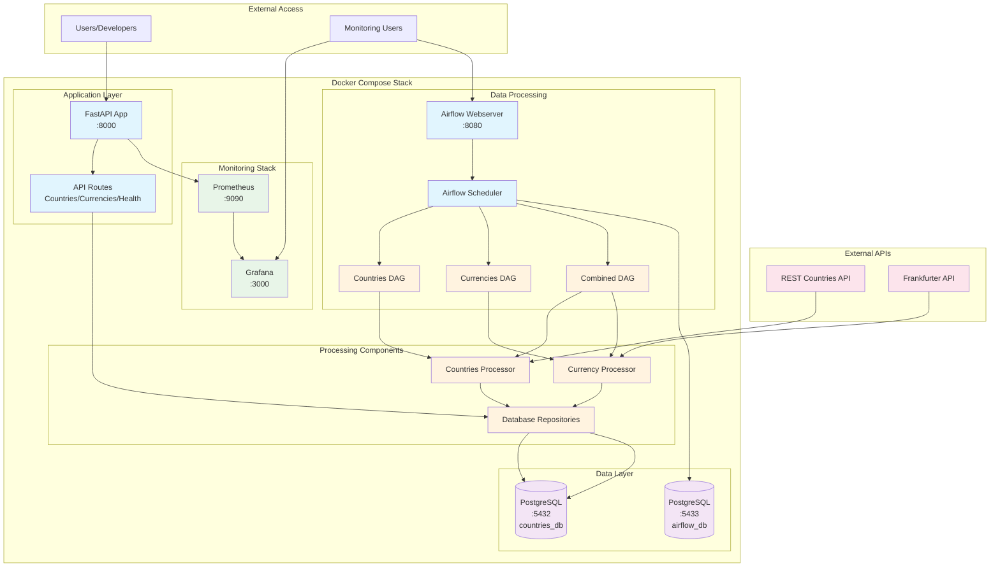
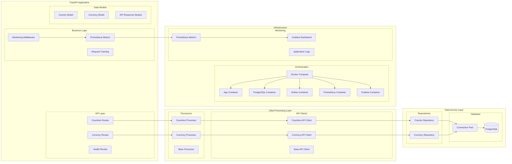
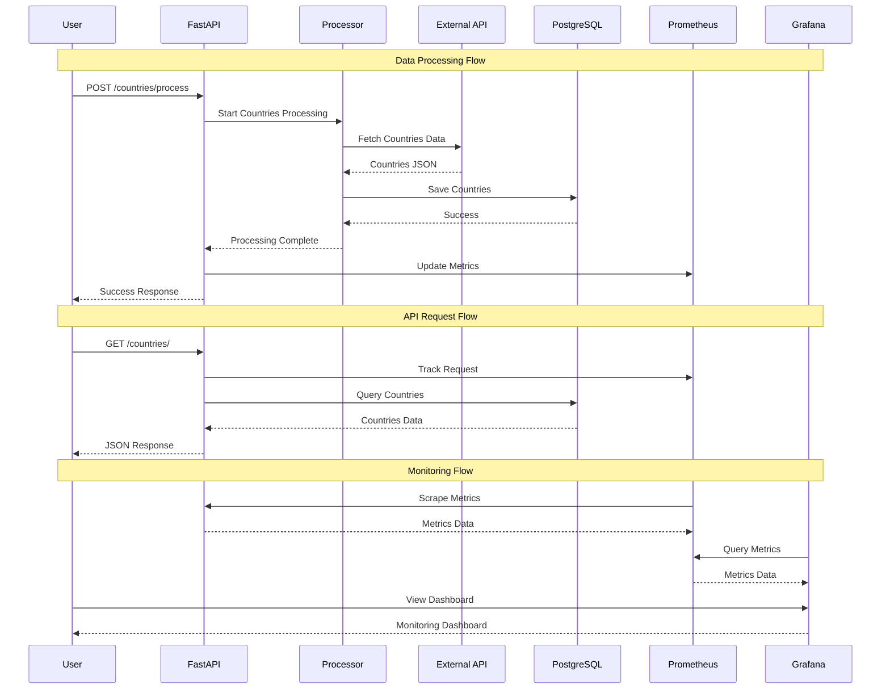
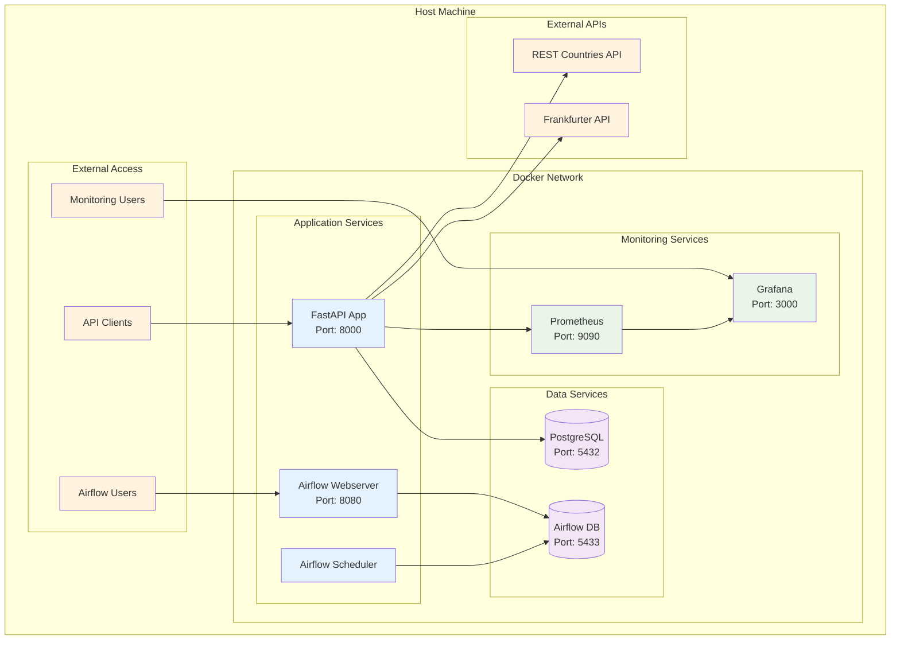
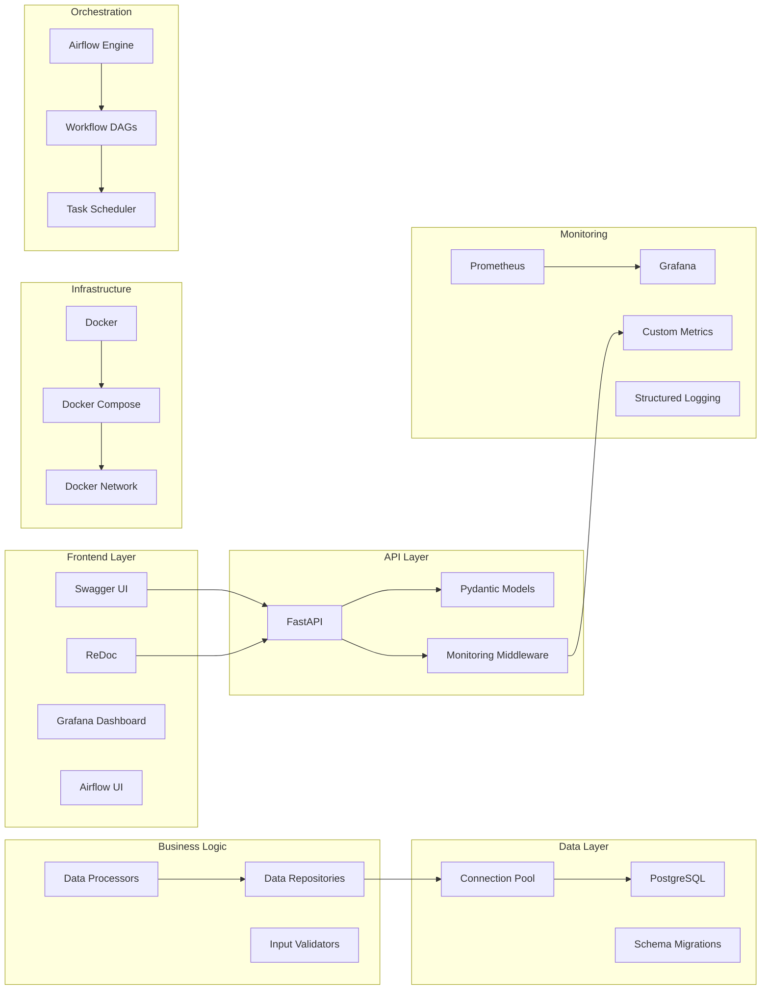

# System Architecture

## High-Level Architecture Diagram

## Detailed Component Architecture

## Data Flow Architecture

## Deployment Architecture

## Technology Stack Architecture

This architecture documentation provides multiple views of your system:

1. **High-Level Architecture**: Shows the overall system components and their relationships
2. **Detailed Component Architecture**: Breaks down the internal structure of each component
3. **Data Flow Architecture**: Illustrates how data moves through the system
4. **Deployment Architecture**: Shows the physical deployment and network topology
5. **Technology Stack Architecture**: Maps the technology choices to architectural layers

You can:
1. **Copy any of these Mermaid diagrams** into GitHub (they render automatically)
2. **Use online Mermaid editors** to export as PNG/SVG
3. **Use the Mermaid CLI** to generate images locally
4. **Include them in your README.md** for better documentation

The diagrams showcase your production-grade architecture with proper separation of concerns, monitoring, and scalability considerations!
