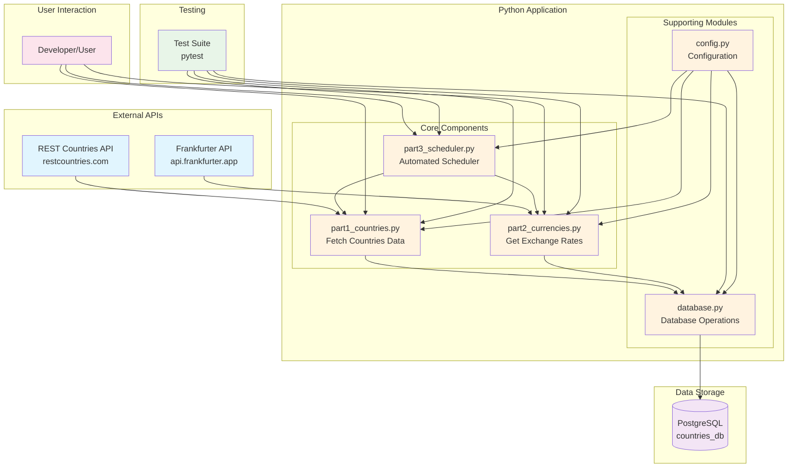
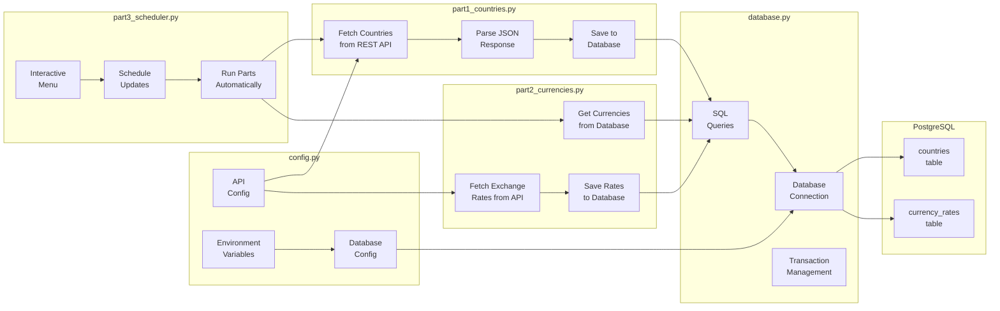
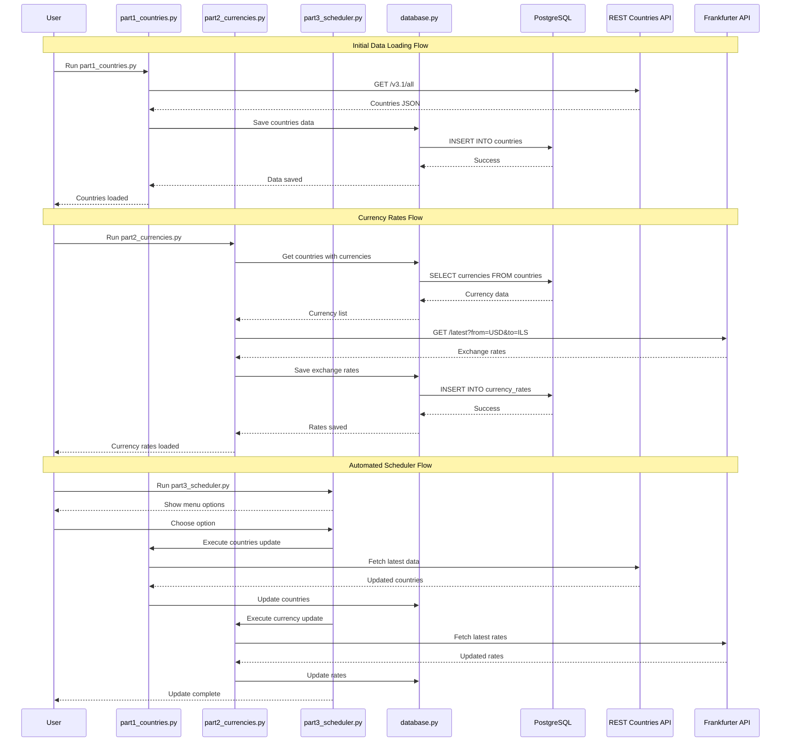
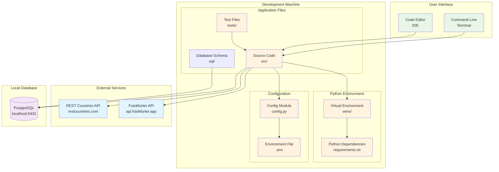
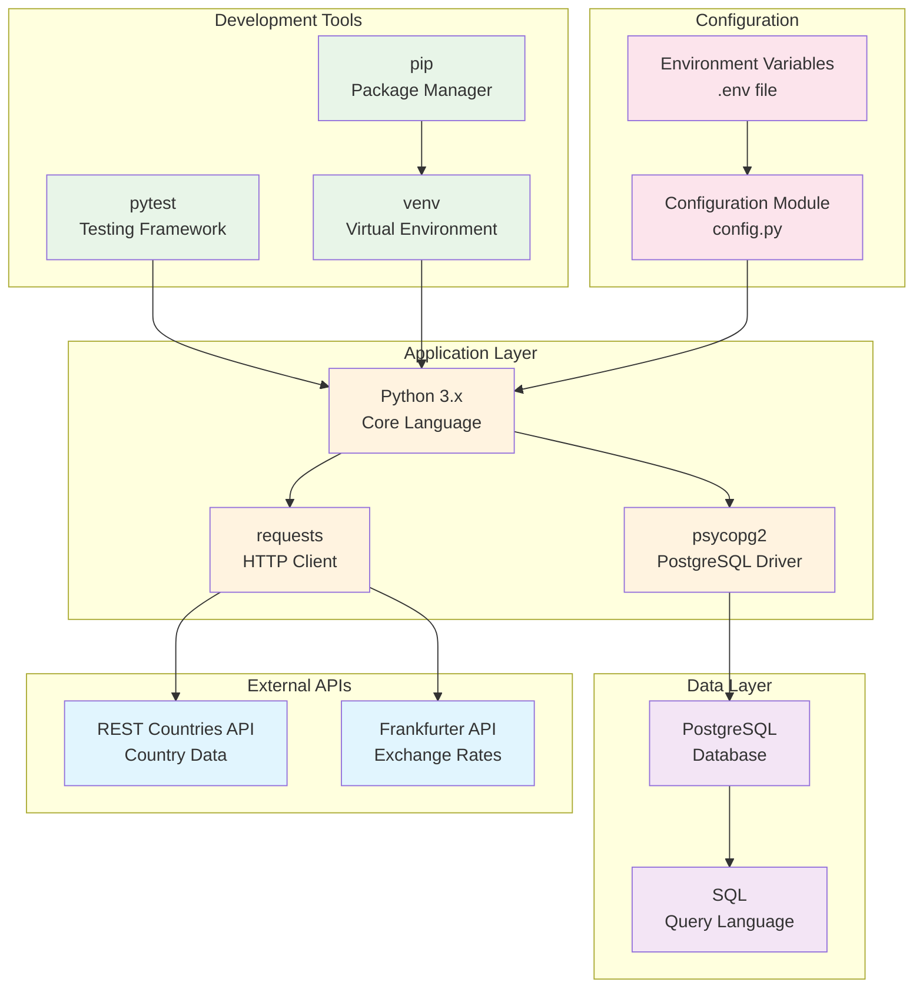

# POC System Architecture

## Simple POC Architecture Overview



## Detailed Component Architecture



## Data Flow Architecture



## Simple Deployment Architecture



## Technology Stack Architecture



## Simple Process Flow

```mermaid
flowchart TD
    START([Start]) --> CHOICE{Choose Operation}
    
    CHOICE -->|Option 1| P1[Run part1_countries.py]
    CHOICE -->|Option 2| P2[Run part2_currencies.py]
    CHOICE -->|Option 3| P3[Run part3_scheduler.py]
    CHOICE -->|Option 4| TEST[Run Tests]
    
    P1 --> FETCH1[Fetch Countries from API]
    FETCH1 --> PARSE1[Parse JSON Response]
    PARSE1 --> SAVE1[Save to Database]
    SAVE1 --> SUCCESS1[Countries Loaded]
    
    P2 --> GET_CURR[Get Currencies from DB]
    GET_CURR --> FETCH2[Fetch Exchange Rates]
    FETCH2 --> PARSE2[Parse Rate Data]
    PARSE2 --> SAVE2[Save Rates to DB]
    SAVE2 --> SUCCESS2[Rates Loaded]
    
    P3 --> MENU[Show Menu Options]
    MENU --> SCHED_CHOICE{Choose Schedule}
    SCHED_CHOICE -->|Manual| MANUAL[Run Parts Manually]
    SCHED_CHOICE -->|Auto| AUTO[Schedule Automatic Updates]
    MANUAL --> P1
    AUTO --> SCHEDULER[Set up Scheduler]
    SCHEDULER --> WAIT[Wait for Schedule]
    WAIT --> P1
    
    TEST --> RUN_TESTS[Execute pytest]
    RUN_TESTS --> TEST_RESULTS[Show Results]
    
    SUCCESS1 --> END([End])
    SUCCESS2 --> END
    TEST_RESULTS --> END
    
    %% Styling
    classDef start fill:#e8f5e8
    classDef process fill:#fff3e0
    classDef decision fill:#e1f5fe
    classDef end fill:#fce4ec
    
    class START,END start
    class P1,P2,P3,TEST,FETCH1,PARSE1,SAVE1,GET_CURR,FETCH2,PARSE2,SAVE2,MENU,MANUAL,AUTO,SCHEDULER,WAIT,RUN_TESTS process
    class CHOICE,SCHED_CHOICE decision
    class SUCCESS1,SUCCESS2,TEST_RESULTS end
```

This architecture documentation represents the simple POC version with:

1. **Simple Component Architecture**: Basic Python scripts with clear separation of concerns
2. **Data Flow**: Straightforward data fetching and storage process
3. **Deployment**: Local development setup with minimal dependencies
4. **Technology Stack**: Simple, lightweight technology choices
5. **Process Flow**: Clear step-by-step execution flow

The POC version focuses on demonstrating core functionality with minimal complexity, making it easy to understand and extend.
